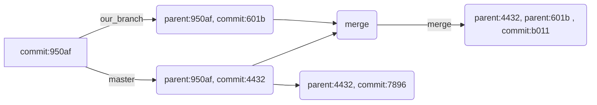

#  *Storage and Compression Techniques*

In Git the packages area compressed to consume less space. An Index file keeps the track of the offsets which is pointed to specific objects which corresponds to compressed packages. To count the object counts, type `git count-objects` . We can delete the loose files and instead use the redundant files with plumbing commands if we want more cohesion between files and make them strongly grouped. With the new evolved Git, the checksums for packages and the index files are stored in index file itself. This can give rise to the untraceable corrupted file since the repairing phase cant detect the corrupted files. 
In Version2 of the pack the CRC checksum is stored into index pack file and solves the problem of corrupt file. Version2 is now expandable up to pack files larger than 4 GB, which is greater than earlier version. To detect the corrupt files, there is an 20 byte Sha sum of all the sha's at the end of the file. This protects from the data corruption.
Git calculates the commits and content that need to be transferred to repository or individual path and generates the pack file format to send to desired protocol.

# *Merge Histories*

Git differs from the merge approach than the RCS and  family of Version control software. In subversion, merge is represented as linear progression in tree history. The superior or parent precedence takes the supersede before anything. Direct branching is not allowed, only as indirect structure within repository. In subversion, if we are working on a branch at the root `branches/branch-name` we are working on the adjacent trunk which is parallel to trunk where the master code resides.
we might be working on different software at same time and we want to merge in some subbranch. After merging, we proceed with the overwrite. Later, we want to merge everything into trunk after completion of the work and the trunk has no recollection of earlier changes into merge and even the branches are merged into trunk.
VCS like Git is based on DAG based merger. Lets say that the other subbranches have no commits made into our branch, we can know from the parent-child relation from the graph that the head tip is merged into our branch. The merge commit of our branch knows it merged with the current head from the SHA hashes of the parent. Git has the ability to pick commits from other branch to current branch.

 
